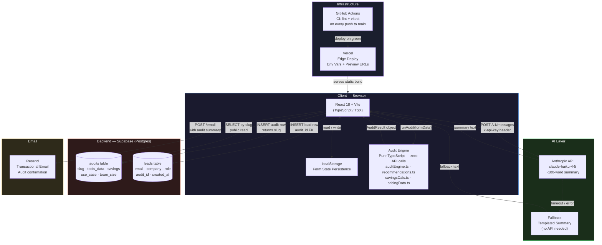
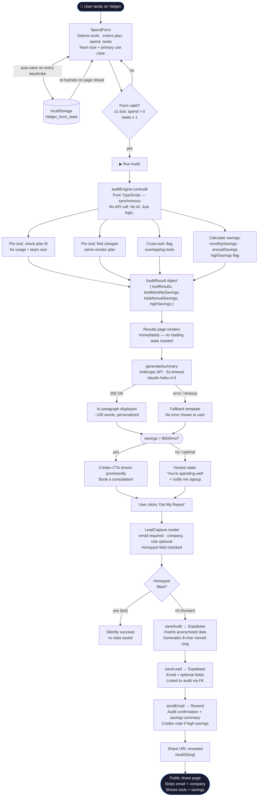

# ARCHITECTURE.md

## 1. System Architecture Diagram

```mermaid
flowchart TB
    subgraph Browser["Client — Browser"]
        direction TB
        UI["React 18 + Vite\n(TypeScript / TSX)"]
        LS["localStorage\nForm State Persistence"]
        AE["Audit Engine\nPure TypeScript — zero API calls\nauditEngine.ts · recommendations.ts\nsavingsCalc.ts · pricingData.ts"]
    end
 
    subgraph AI["AI Layer"]
        ANTH["Anthropic API\nclaude-haiku-4-5\n~100-word summary"]
        FB["Fallback\nTemplated Summary\n(no API needed)"]
    end
 
    subgraph Backend["Backend — Supabase (Postgres)"]
        direction LR
        AT[("audits table\nslug · tools_data · savings\nuse_case · team_size")]
        LT[("leads table\nemail · company · role\naudit_id · created_at")]
    end
 
    subgraph Email["Email"]
        RS["Resend\nTransactional Email\nAudit confirmation"]
    end
 
    subgraph Infra["Infrastructure"]
        VCL["Vercel\nEdge Deploy\nEnv Vars + Preview URLs"]
        CI["GitHub Actions\nCI: lint + vitest\non every push to main"]
    end
 
    UI <-->|"read / write"| LS
    UI -->|"runAudit(formData)"| AE
    AE -->|"AuditResult object"| UI
    UI -->|"POST /v1/messages\nx-api-key header"| ANTH
    ANTH -->|"summary text"| UI
    ANTH -. "timeout / error" .-> FB
    FB -->|"fallback text"| UI
    UI -->|"INSERT audit row\nreturns slug"| AT
    UI -->|"INSERT lead row\naudit_id FK"| LT
    UI -->|"POST /email\nwith audit summary"| RS
    UI -->|"SELECT by slug\npublic read"| AT
    CI -->|"deploy on green"| VCL
    VCL -->|"serves static build"| Browser
 
    style Browser fill:#1a1a2e,stroke:#4a9eff,color:#fff
    style AI fill:#1a2e1a,stroke:#4aff7a,color:#fff
    style Backend fill:#2e1a1a,stroke:#ff7a4a,color:#fff
    style Email fill:#2e2a1a,stroke:#ffcc4a,color:#fff
    style Infra fill:#1a1e2e,stroke:#aa7aff,color:#fff
```
 
---

## 2. Data Flow Diagram

```mermaid
flowchart TD
    A(["👤 User lands on Velqen"]):::user
 
    A --> B["SpendForm\nSelects tools · enters plan, spend, seats\nTeam size + primary use case"]
    B <-->|"auto-save on every keystroke"| C[("localStorage\nVelqen_form_state")]
    C -->|"re-hydrate on page reload"| B
 
    B --> D{"Form valid?\n≥1 tool, spend > 0\nseats ≥ 1"}
    D -->|"no"| B
    D -->|"yes"| E
 
    E["▶ Run Audit"]
    E --> F["auditEngine.runAudit\nPure TypeScript — synchronous\nNo API call. No AI. Just logic."]
 
    F --> F1["Per-tool: check plan fit\nfor usage + team size"]
    F --> F2["Per-tool: find cheaper\nsame-vendor plan"]
    F --> F3["Cross-tool: flag\noverlapping tools"]
    F --> F4["Calculate savings:\nmonthlySavings · annualSavings\nhighSavings flag"]
 
    F1 & F2 & F3 & F4 --> G["AuditResult object\n{ toolResults, totalMonthlySavings,\ntotalAnnualSavings, highSavings }"]
 
    G --> H["Results page renders\nimmediately — no loading state needed"]
 
    H --> I["generateSummary\nAnthropic API · 5s timeout\nclaude-haiku-4-5"]
    I -->|"200 OK"| J["AI paragraph displayed\n~100 words, personalized"]
    I -->|"error / timeout"| K["Fallback template\nNo error shown to user"]
    J & K --> L
 
    L{{"savings > $500/mo?"}}
    L -->|"yes"| M["Credex CTA shown prominently\n'Book a consultation'"]
    L -->|"no / optimal"| N["Honest state:\n'You're spending well'\n+ notify me signup"]
    M & N --> O
 
    O["User clicks 'Get My Report'"]
    O --> P["LeadCapture modal\nemail required · company, role optional\nHoneypot field checked"]
 
    P --> P1{"Honeypot\nfilled?"}
    P1 -->|"yes (bot)"| P2["Silently succeed\nno data saved"]
    P1 -->|"no (human)"| Q
 
    Q["saveAudit → Supabase\nInserts anonymized data\nGenerates 8-char nanoid slug"]
    Q --> R["saveLead → Supabase\nEmail + optional fields\nLinked to audit via FK"]
    R --> S["sendEmail → Resend\nAudit confirmation + savings summary\nCredex note if high-savings"]
    S --> T["Share URL revealed\n/audit/[slug]"]
 
    T --> U(["Public share page\nStrips email + company\nShows tools + savings"]):::user
 
    classDef user fill:#1a1a2e,stroke:#4a9eff,color:#fff,rx:20
```
 
---

